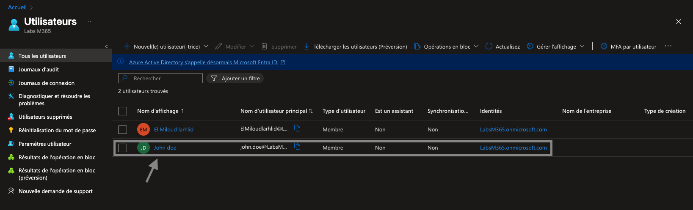
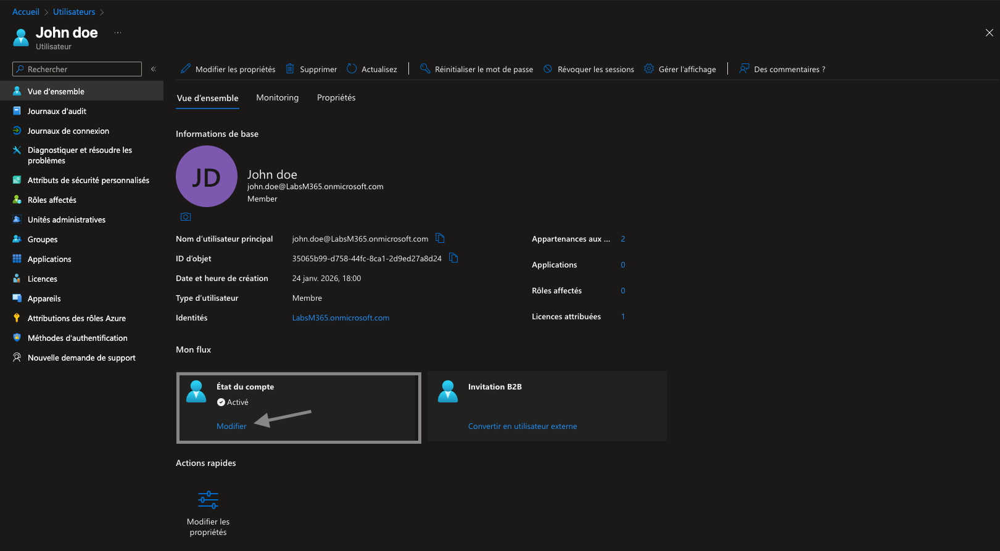
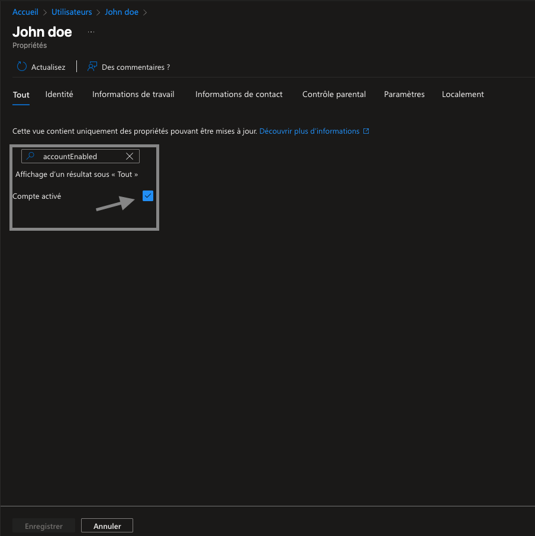
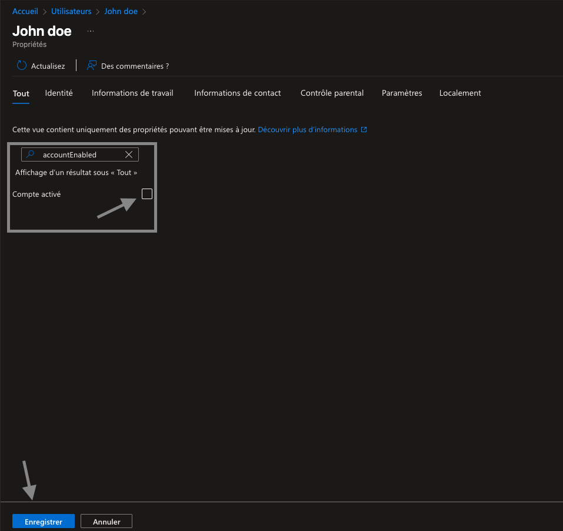
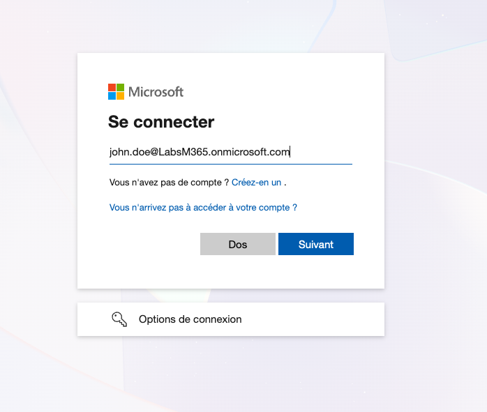
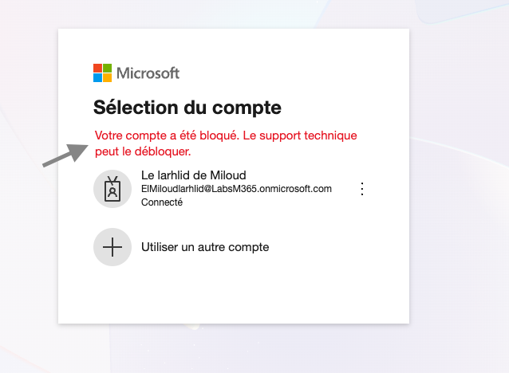
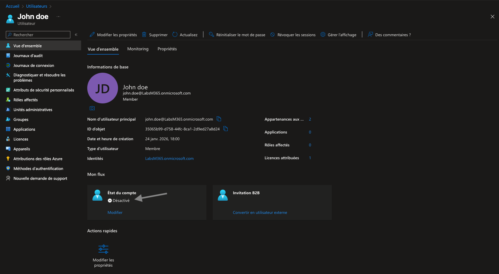

# Lab M365 – Blocage et déblocage d’un compte utilisateur
## Objectif du laboratoire
Ce laboratoire présente comment bloquer et débloquer un compte utilisateur dans Microsoft Entra ID (Azure AD), une opération fréquente réalisée par un IT Support niveau 1 / 2 pour des raisons de sécurité ou de gestion des accès.
Le scénario simule un compte utilisateur bloqué, l’impact côté utilisateur final, puis la remise en service du compte.

## Scénario
Suite à une activité suspecte ou une demande interne, le compte d’un utilisateur (John Doe) doit être temporairement bloqué afin d’empêcher toute connexion.
L’objectif est de :
1. Désactiver le compte côté administrateur
2. Vérifier l’impact côté utilisateur
3. Réactiver le compte une fois la situation résolueç

## Étape 1 – Accéder à la liste des utilisateurs
Depuis le portail Microsoft Entra :
  1. Aller dans Microsoft Entra ID
  2. Cliquer sur Utilisateurs
  3. Sélectionner l’utilisateur concerné (John Doe)

 

## Étape 2 – Vérifier l’état initial du compte
Dans la vue d’ensemble de l’utilisateur :
Le compte est Actif
L’utilisateur peut se connecter normalement

 

## Étape 3 – Modifier l’état du compte
Cliquer sur Modifier
Accéder aux Propriétés
Localiser le paramètre Compte actif (accountEnabled)

 

## Étape 4 – Bloquer le compte utilisateur
Désactiver l’option Compte actif
Enregistrer les modifications

## Étape 5 – Vérifier l’impact côté utilisateur
Lors d’une tentative de connexion :
L’utilisateur reçoit un message indiquant que le compte est bloqué
Seul le support technique peut intervenir

 

## Étape 6 – Confirmer le statut du compte côté administrateur
Dans Microsoft Entra :
Le compte apparaît désormais comme Désactivé

## Étape 7 – Débloquer le compte utilisateur
Une fois la situation résolue :
Réactiver l’option Compte actif
Enregistrer les changements
L’utilisateur peut à nouveau se connecter

 

## Compétences démontrées
  - Gestion des accès Microsoft Entra ID
  - Sécurité des identités
  - Support utilisateur Microsoft 365
  - Diagnostic et résolution d’incident
  - Procédures IT Support réelles (N1 / N2)
