# Configuration des restrictions d’appareil Windows 11 avec Microsoft Intune
## Objectif du lab
Ce laboratoire a pour objectif de créer et déployer une stratégie de restrictions d’appareil pour des postes Windows 11 à l’aide de Microsoft Intune, en s’appuyant sur un groupe de sécurité Microsoft Entra ID.
Ce scénario reflète une situation réelle d’administration Modern Workplace / Endpoint Management, typique d’un environnement d’entreprise.

## Prérequis
Un tenant Microsoft 365 avec Intune activé
Un utilisateur Entra ID disposant d’une licence Intune
Un groupe de sécurité Entra ID
Un poste Windows 11 joint à Microsoft Entra ID et enrôlé dans Intune

## Étape 1 – Accéder à la configuration des appareils dans Intune
Depuis le Centre d’administration Microsoft Intune :
 - Aller dans Appareils
 - Cliquer sur Configuration
 - Sélectionner l’onglet Stratégies
 - Cliquer sur Créer

 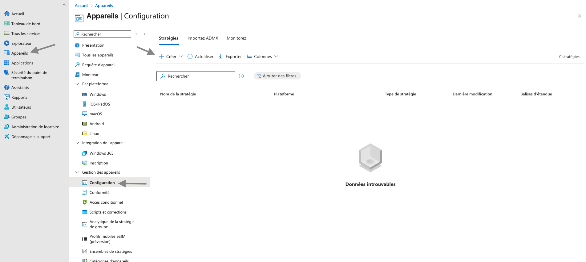 

### Cette section permet de créer des profils de configuration appliqués aux appareils.

## Étape 2 – Créer un nouveau profil de configuration
Lors de la création du profil :
 - Plateforme : Windows 10 et versions ultérieures
 - Type de profil : Modèles
 - Nom du modèle : Restrictions d’appareil
 - Cliquer sur Créer pour continuer.

 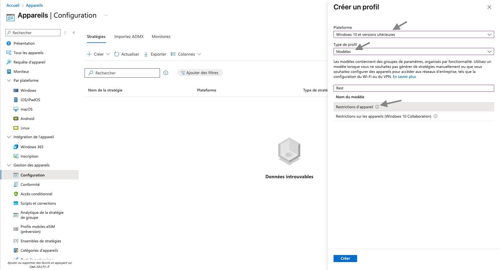 

## Étape 3 – Informations de base du profil
Renseigner les informations suivantes :
 - Nom : WIN11 – Baseline – Device Restrictions
 - Description :
 - Basic Intune configuration policy to apply standard device restrictions on Windows 11 devices.

 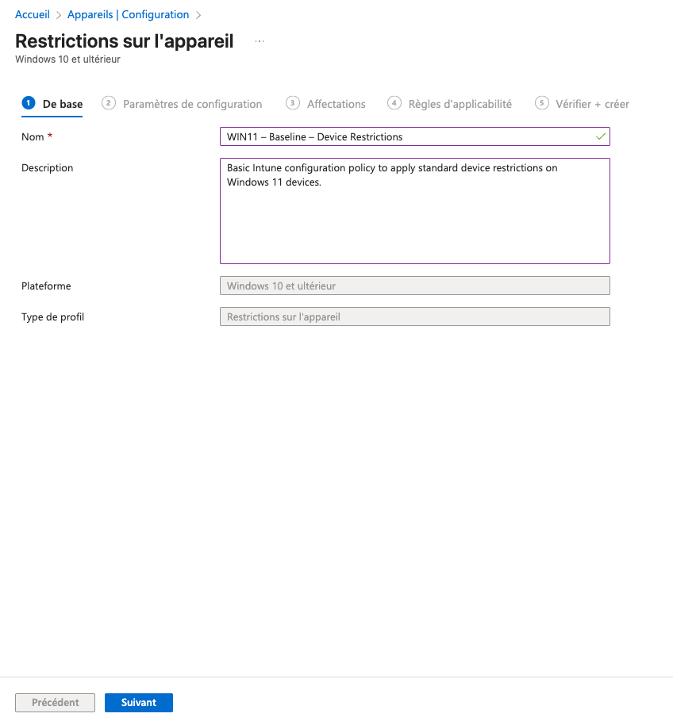  

### Ces éléments facilitent l’identification de la stratégie dans un environnement d’entreprise.

## Étape 4 – Configuration des restrictions d’appareil
Dans la section Paramètres de configuration, configurer les catégories nécessaires, par exemple :
 - Système : Bloquer
 - Réseau et Internet : Bloquer
 - Personnalisation : Bloquer
 - Applications : Bloquer
 - Comptes : Bloquer

 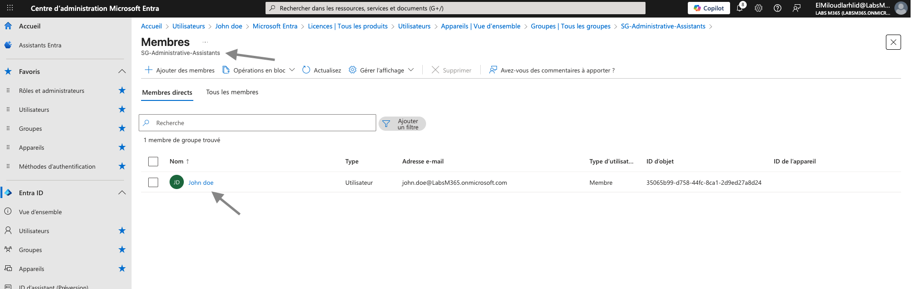  
 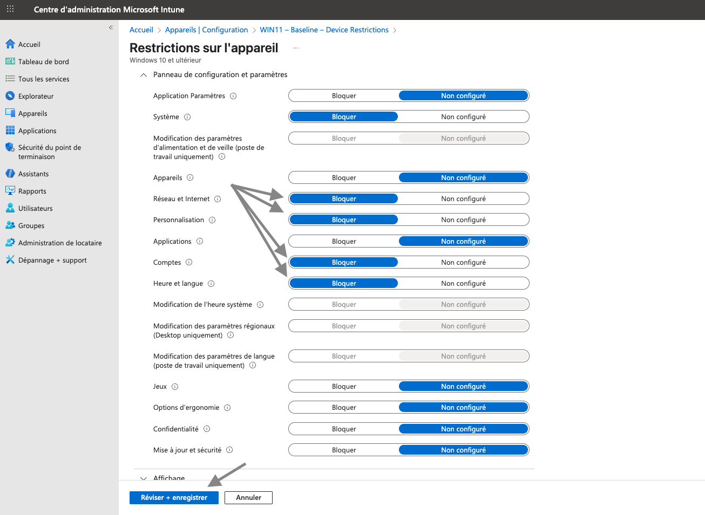  

### Ces paramètres permettent de renforcer la posture de sécurité des postes utilisateurs.
Cliquer sur Réviser + enregistrer.

## Étape 5 – Affectation du profil à un groupe Entra ID
Dans l’étape Affectations :
Cliquer sur Ajouter des groupes
Sélectionner le groupe : SG-Administrative-Assistants
Valider la sélection

📸 Captures associées :

  

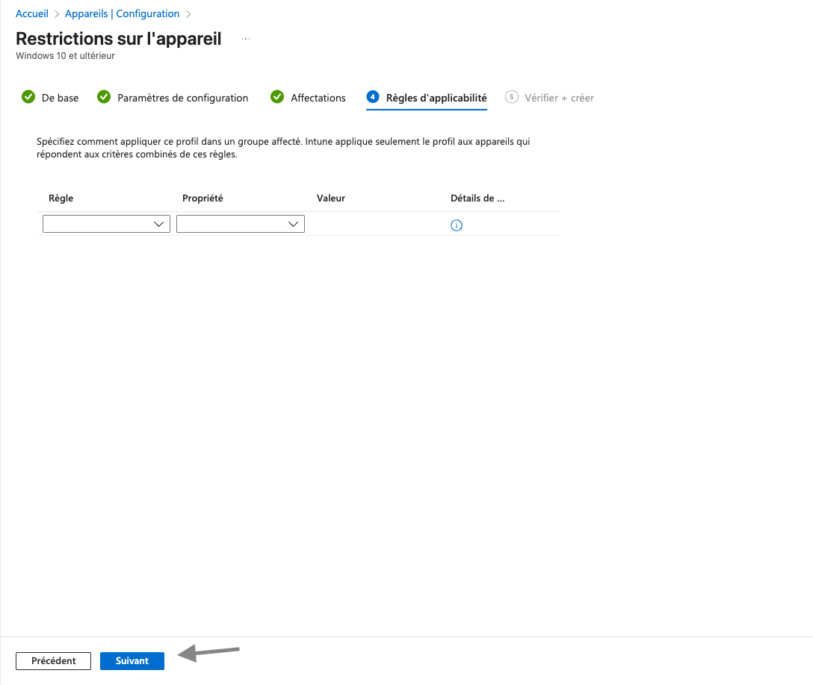  

### Ce profil sera appliqué à tous les membres du groupe ciblé.

## Étape 6 – Règles d’applicabilité
Dans cette étape, aucune règle spécifique n’est définie.

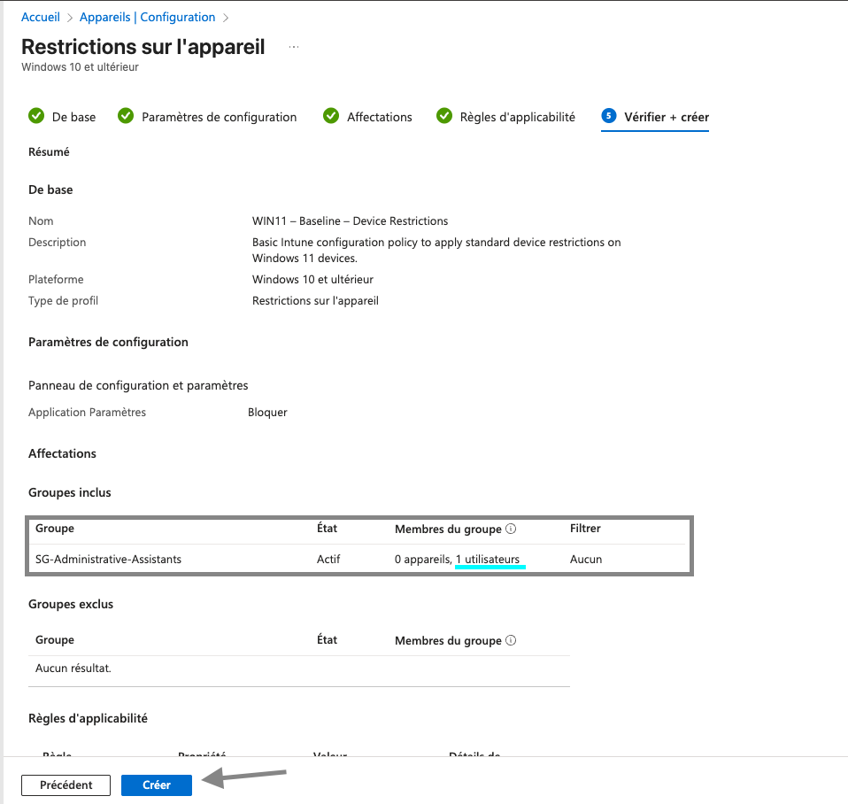
Cliquer sur Suivant pour continuer.

## Étape 7 – Vérification et création
Vérifier le résumé de la stratégie :
Nom et description
Plateforme ciblée
Paramètres configurés
Groupe assigné

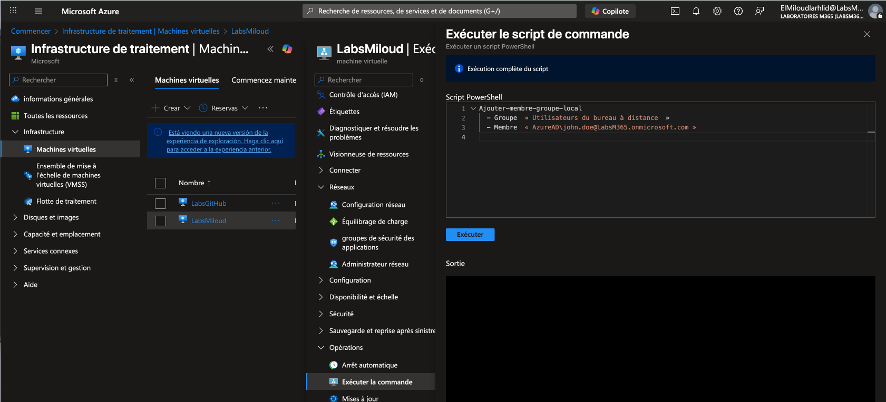

Cliquer sur Créer pour déployer la stratégie.

## Étape 8 – Ajout de l’utilisateur Entra ID au groupe local RDP (Azure VM)
Depuis le portail Microsoft Azure, sur la machine virtuelle Windows :
Ouvrir Exécuter la commande
Lancer un script PowerShell pour ajouter l’utilisateur Entra ID au groupe Remote Desktop Users

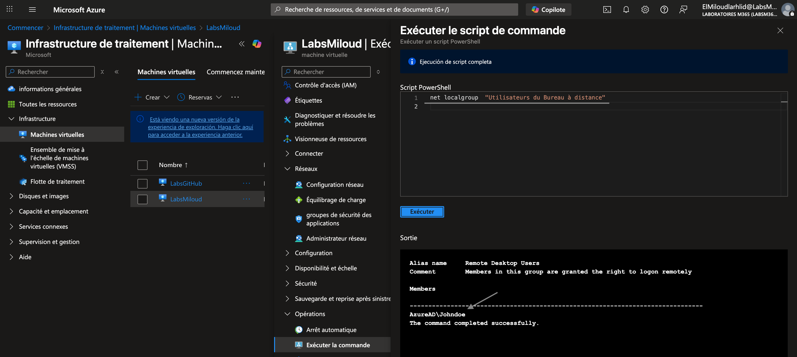

### Cette étape permet d’autoriser l’accès RDP à l’utilisateur synchronisé depuis Entra ID.

## Étape 9 – Vérification de l’appartenance au groupe RDP
Toujours via Run Command, exécuter une commande de vérification afin de confirmer que l’utilisateur est bien membre du groupe local Remote Desktop Users.

### La sortie confirme que l’utilisateur AzureAD\JohnDoe dispose des droits de connexion à distance.

## Étape 10 - Vérification de l’état de check-in Intune
Après l’affectation de la stratégie, l’appareil effectue un check-in avec Microsoft Intune.
Résultat observé :
- Succès : 1
- Erreur : 0
- Conflit : 0
- Non applicable : 0
### Cela confirme que la stratégie WIN11 – Baseline – Device Restrictions a bien été reçue par l’appareil.

## Étape 11 - Tentative de modification réseau côté utilisateur
Depuis le poste Windows 11 connecté avec l’utilisateur john.doe, une tentative de désactivation de l’adaptateur réseau est effectuée :
Paramètres → Réseau et Internet → Paramètres réseau avancés
Action : Désactiver l’adaptateur Ethernet

###  Résultat attendu :
  - L’action est bloquée par la stratégie Intune
  - Une élévation de privilèges est requise

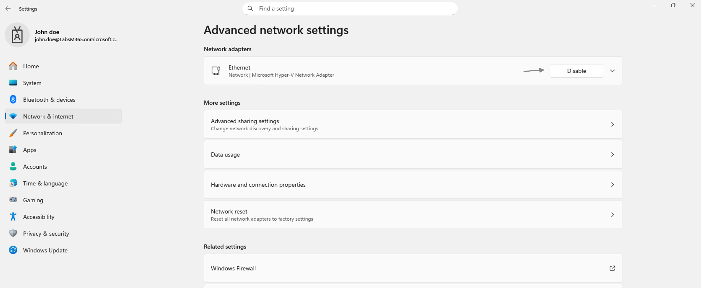

## Étape 12 - Demande d’élévation (UAC) – Confirmation de la restriction
Lors de la tentative de modification, Windows affiche une invite UAC demandant des identifiants administrateur.
Cela confirme que :
  - Les paramètres système sont restreints pour les utilisateurs standards
  - La stratégie Intune est effective et appliquée localement

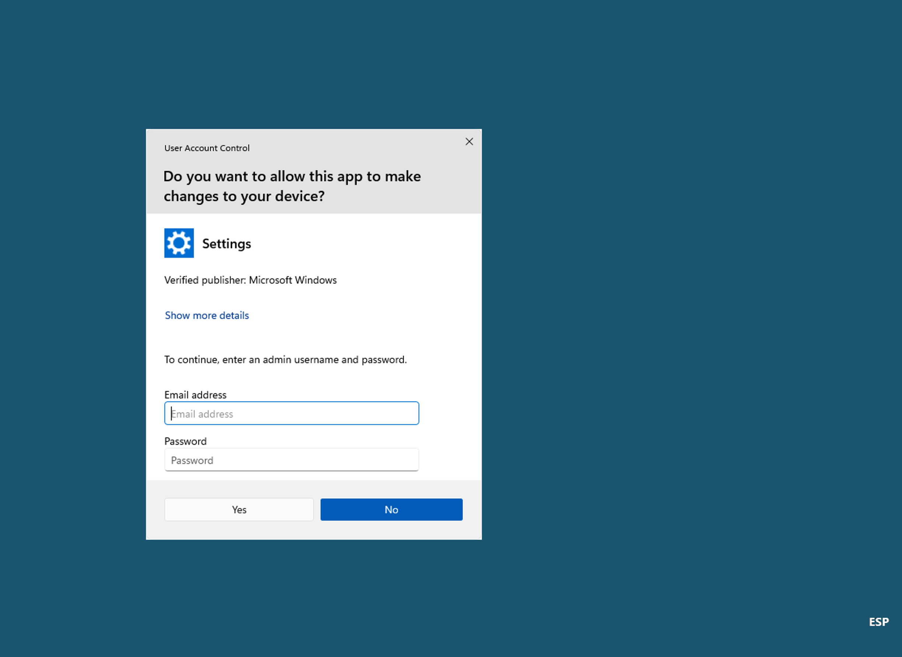

## Ce laboratoire démontre une gestion End-to-End :
- Intune (stratégies)
- Entra ID (groupes et identités)
- Azure VM
- Validation locale côté OS
