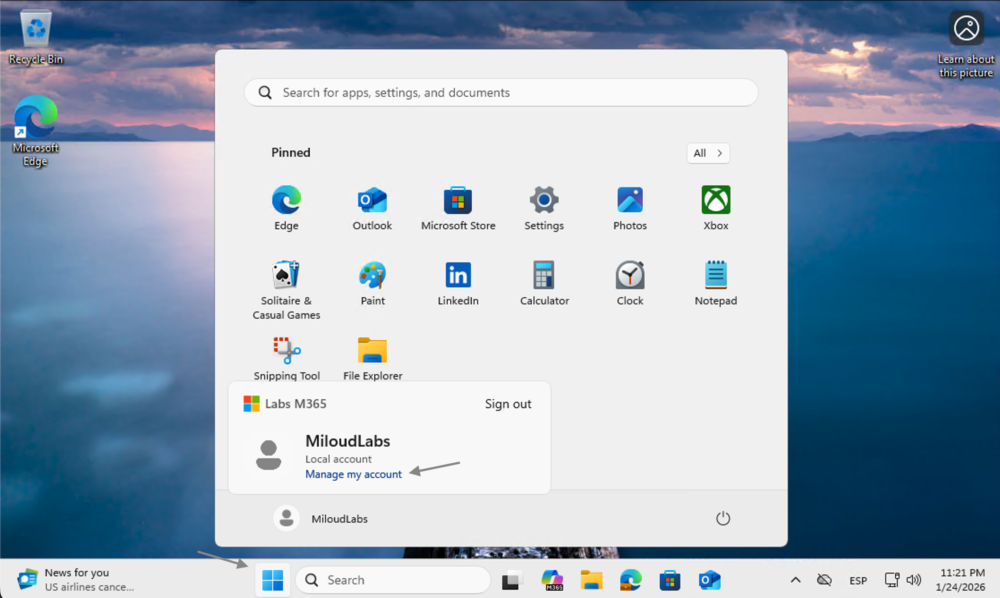
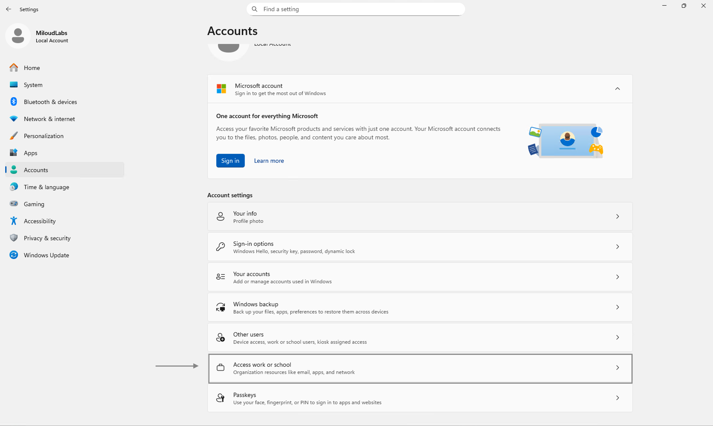
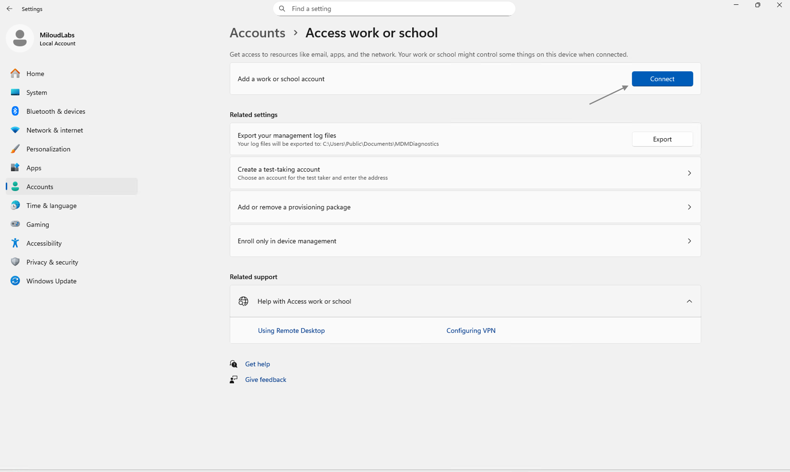
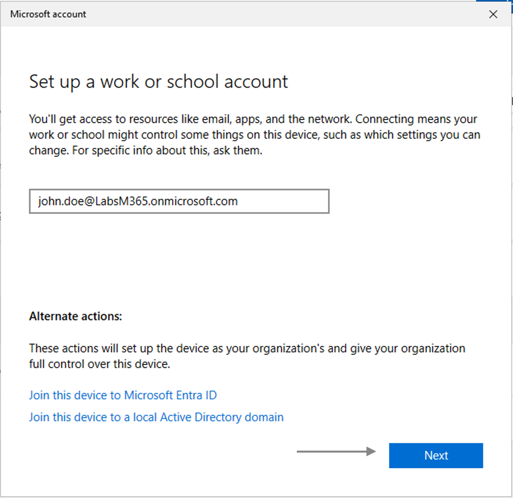
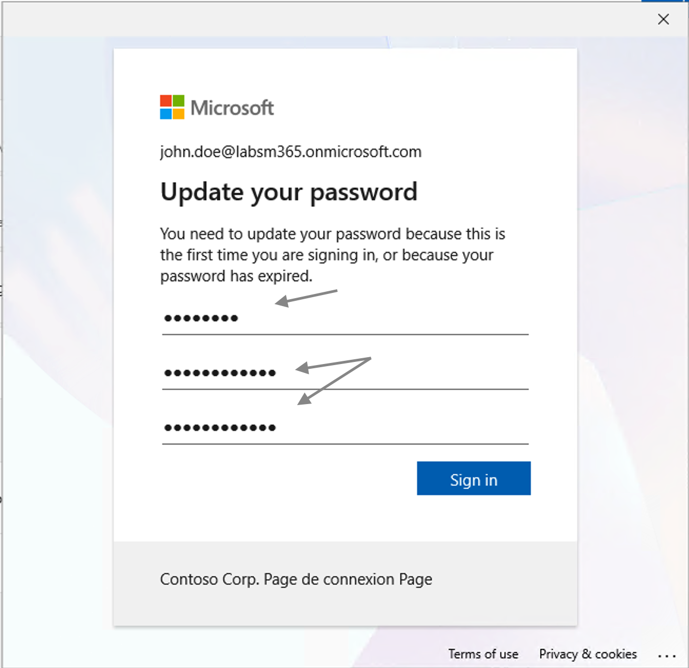
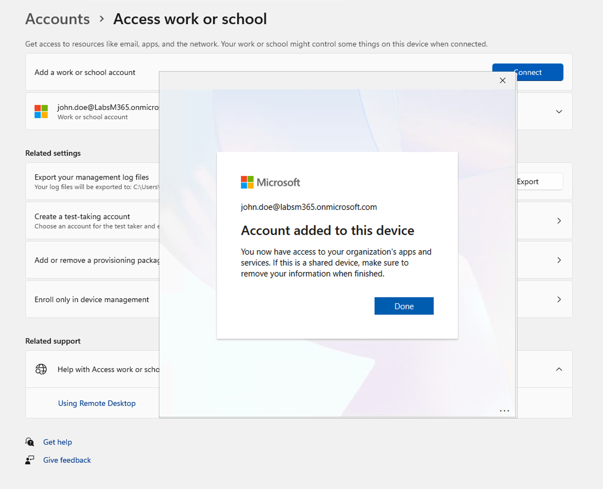
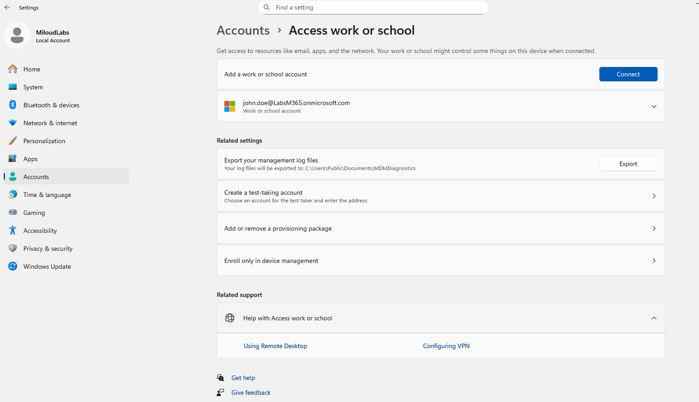

# Lab Microsoft Entra ID – Enrôlement d’un poste Windows 11 (Work or School)
## Objectif du laboratoire
Ce laboratoire a pour objectif de démontrer l’ajout et l’enrôlement d’un poste Windows 11 dans Microsoft Entra ID à l’aide d’un compte professionnel ou scolaire.
Ce scénario correspond à une situation réelle en entreprise, où un technicien IT prépare un poste utilisateur afin de :
permettre l’accès aux ressources de l’organisation,
préparer l’application de politiques de sécurité,
faciliter la gestion via Intune (MDM).

## Contexte du scénario
Un nouvel utilisateur (John Doe) rejoint l’entreprise. Son compte Microsoft Entra ID est déjà créé, et il doit maintenant se connecter sur un poste Windows 11 afin d’accéder aux ressources professionnelles.
Le poste est actuellement configuré avec un compte local.

## Étape 1 – Accéder au menu Démarrer
Cliquer sur le bouton Démarrer de Windows
Vérifier que le poste est connecté avec un compte local
 

## Étape 2 – Ouvrir les paramètres de comptes
Ouvrir Paramètres
Aller dans Comptes
Sélectionner Accès professionnel ou scolaire
 

## Étape 3 – Ajouter un compte professionnel
Cliquer sur Se connecter
Choisir Ajouter un compte professionnel ou scolaire
 

## Étape 4 – Saisir l’adresse professionnelle
Entrer l’adresse e-mail :
john.doe@LabsM365.onmicrosoft.com
Cliquer sur Suivant
 

## Étape 5 – Mise à jour du mot de passe
Lors de la première connexion, l’utilisateur est invité à mettre à jour son mot de passe.
Saisir l’ancien mot de passe
Définir un nouveau mot de passe conforme à la politique de sécurité
Cliquer sur Se connecter
 

## Étape 6 – Compte ajouté avec succès
Un message confirme que le compte professionnel a été ajouté au poste.
Le poste a désormais accès aux ressources de l’organisation.
 

## Étape 7 – Vérification dans Windows
Revenir dans Paramètres → Comptes → Accès professionnel ou scolaire
Vérifier que le compte john.doe@LabsM365.onmicrosoft.com apparaît bien
 

Compétences démontrées
- Windows 11
- Microsoft Entra ID
- Enrôlement des appareils
- Support IT utilisateur (onboarding)
