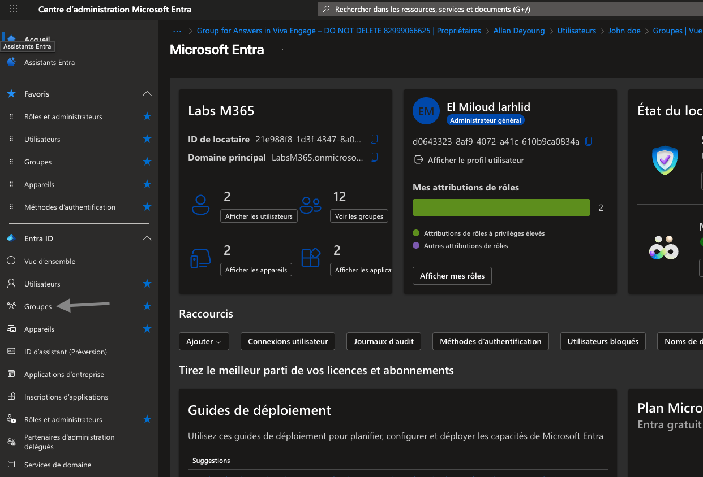
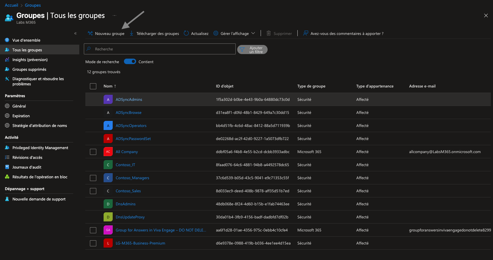
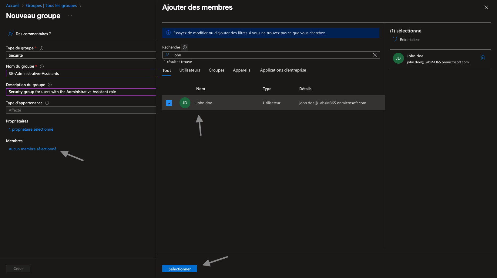
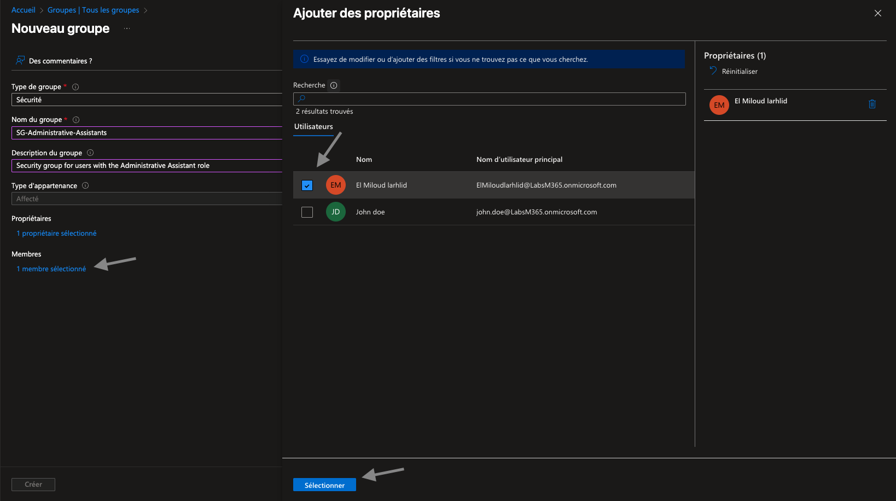
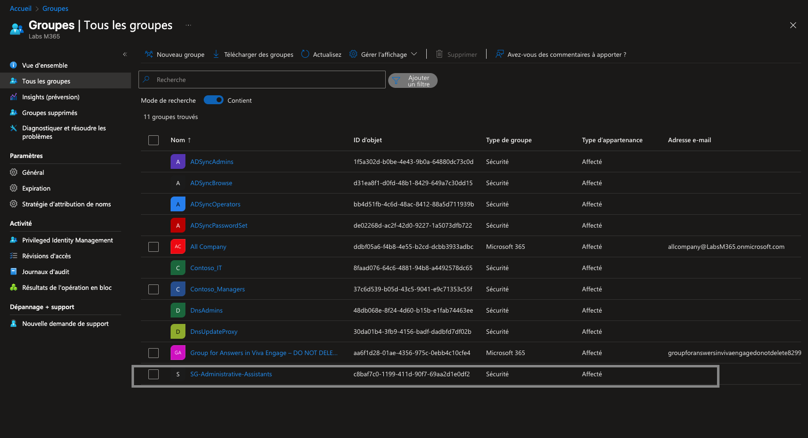
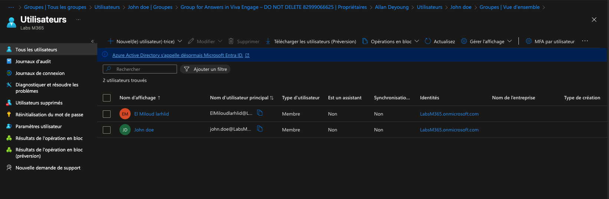

# Lab Microsoft Entra ID – Création et gestion d’un groupe de sécurité

## Objectif du laboratoire

Ce laboratoire a pour objectif de démontrer la création et la gestion d’un groupe de sécurité dans Microsoft Entra ID (ex Azure Active Directory).
Il s’adresse à un contexte réaliste d’entreprise, où les groupes sont utilisés pour :
- gérer les accès,
- organiser les utilisateurs,
- préparer l’attribution de rôles ou de politiques (Intune, RBAC, etc.).

L’entreprise souhaite créer un groupe de sécurité destiné aux assistants administratifs, afin de pouvoir leur attribuer ultérieurement des droits ou des politiques spécifiques.
Le groupe sera nommé :
### - SG-Administrative-Assistants

## Étape 1 – Accéder à la gestion des groupes
1. Se connecter au Centre d’administration Microsoft Entra
2. Naviguer vers : Groupes → Tous les groupes
3. Cliquer sur « Nouveau groupe »

## Étape 2 – Informations de base du groupe
Renseigner les informations suivantes :
- Type de groupe : Sécurité
- Nom du groupe : SG-Administrative-Assistants
- Description : Security group for users with the Administrative Assistant role
- Type d’appartenance : Affecté

## Étape 3 – Ajouter un propriétaire et un membre
1. Cliquer sur Propriétaires
2. Sélectionner l’utilisateur El Miloud Larhlid
3. Cliquer sur Sélectionner
4. Cliquer sur Membres
2. Rechercher et sélectionner John Doe
3. Cliquer sur Sélectionner
 ### Le propriétaire est responsable de la gestion du groupe.

## Étape 5 – Vérification avant création
  Avant de finaliser, vérifier :
- le nom du groupe,
- le type (Sécurité),
- le propriétaire,
- les membres.
Puis cliquer sur Créer. 

## Étape 6 – Vérification dans la liste des groupes
Une fois le groupe créé :
1. Revenir à Groupes → Tous les groupes
2. Rechercher SG-Administrative-Assistants
3. Vérifier :
     - le type de groupe,
     - l’appartenance,
     - l’ID d’objet.
     - Liste des membres.

## Compétences démontrées
- Microsoft Entra ID
- Gestion des groupes de sécurité
- Gouvernance des identités
- Documentation IT orientée entreprise

