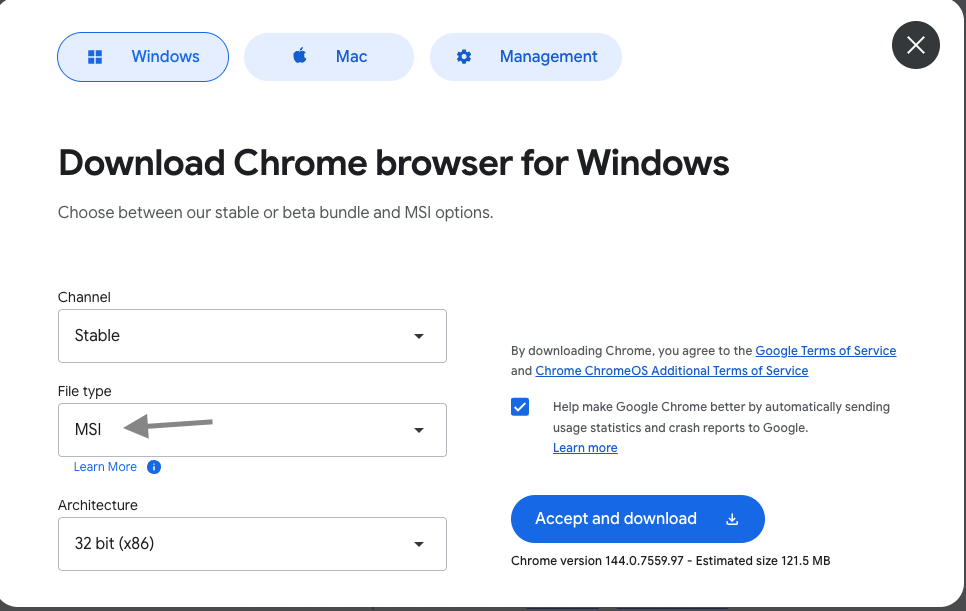
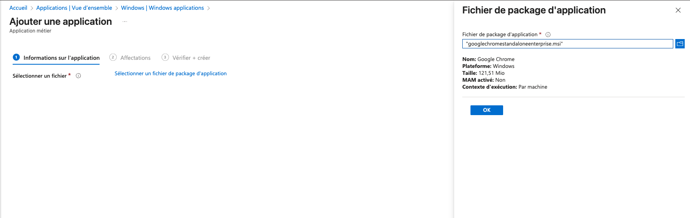
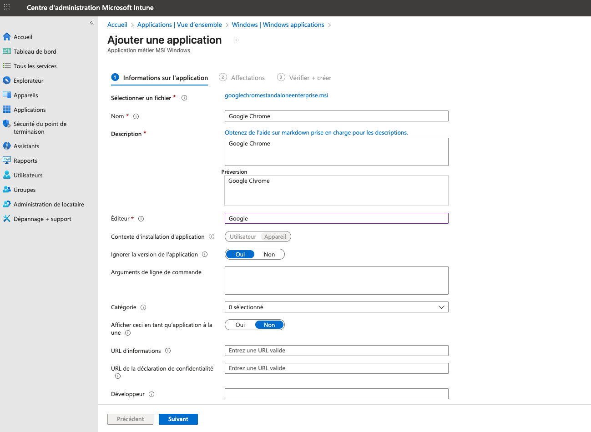
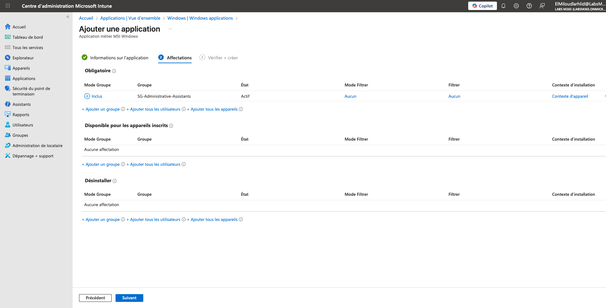

# Lab – Déploiement de Google Chrome (MSI) avec Microsoft Intune
## Objectif du laboratoire

Déployer Google Chrome (version Enterprise MSI) sur des postes Windows 11 via Microsoft Intune, en utilisant une application Windows (Win32), puis vérifier l’installation côté utilisateur.

Ce scénario correspond à une tâche réelle d’Endpoint / IT Support / M365 Admin.

## Prérequis

- Accès au Microsoft Intune Admin Center
- Un tenant Microsoft 365 / Entra ID
- Un poste Windows 11 inscrit dans Intune
- Un groupe de sécurité contenant les appareils cibles

## Étape 1 – Télécharger le package MSI de Google Chrome
Se rendre sur le site officiel Google Chrome Enterprise et télécharger la version MSI.
Points importants :
  - Channel : Stable
  - File type : MSI
  - Architecture : selon l’environnement (x64 recommandé en production)

## Étape 2 – Créer une application Windows dans Intune
Dans le Centre d’administration Microsoft Intune :
  - Applications → Windows → Ajouter
Sélectionner :
  - Application métier (Windows Win32)

## Étape 3 – Importer le package MSI
Importer le fichier :
  - googlechromestandaloneenterprise.msi
Intune détecte automatiquement :
  - Nom de l’application
  - Version
  - Mode d’installation : Par machine

## Étape 4 – Configurer les informations de l’application
Renseigner les champs principaux :
  - Nom : Google Chrome
  - Description : Google Chrome Enterprise Browser
  - Éditeur : Google
  - Contexte d’installation : Appareil
  - Ignorer la version : Oui

### Cette configuration garantit une installation silencieuse et cohérente sur tous les postes.

## Étape 5 – Assigner l’application à un groupe
Dans l’onglet Affectations :
  - Mode : Obligatoire
  - Groupe cible : SG-Administrative-Assistants (exemple)
  - Contexte : Appareil

## Étape 6 – Vérifier l’installation sur Windows 11
Après la synchronisation Intune, vérifier sur le poste utilisateur :
  - Google Chrome apparaît dans le menu Démarrer
  - L’application est installée automatiquement sans interaction utilisateur

## Compétences démontrées
  - Microsoft Intune – Applications Windows (Win32)
  - Déploiement MSI en environnement M365
  - Gestion des affectations par groupes
  - Vérification côté poste client
  - Documentation claire et professionnelle
