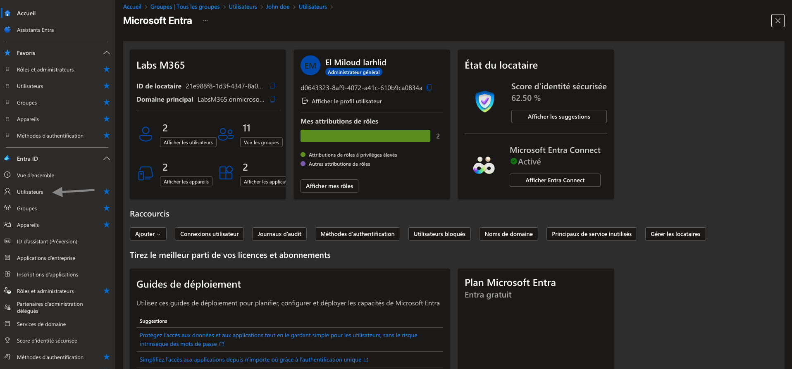
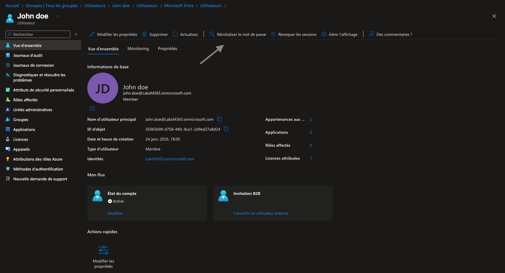
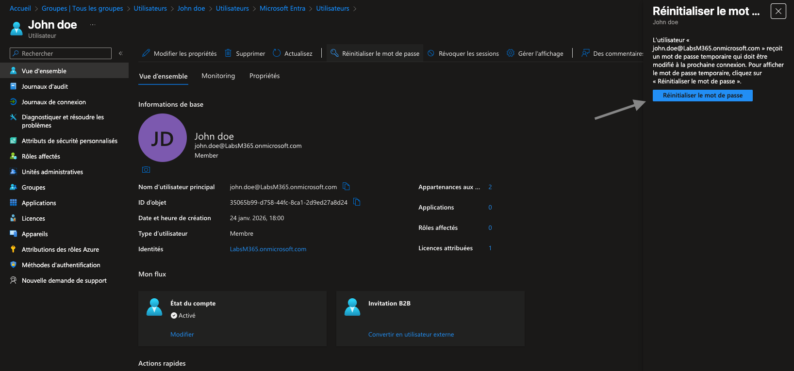
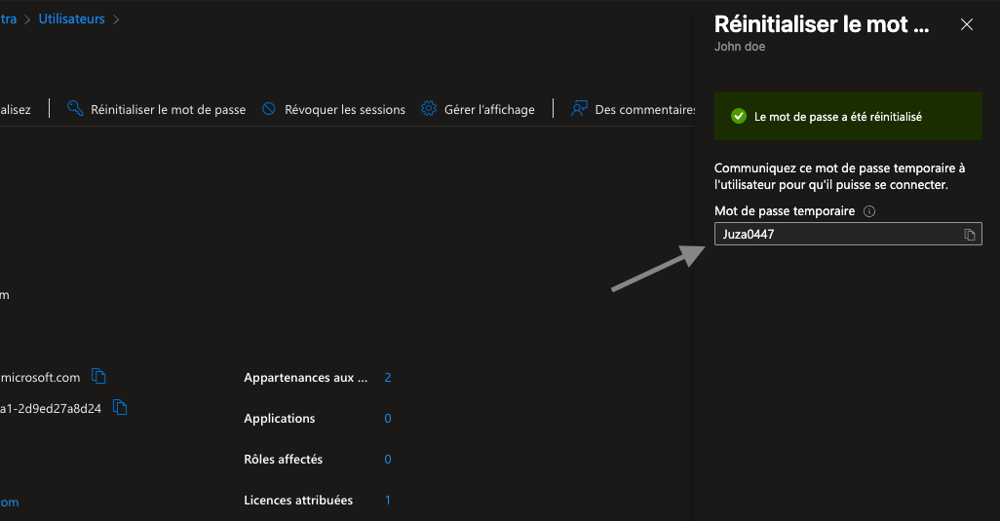

# Réinitialisation du mot de passe utilisateur
## Objectif du laboratoire
Ce laboratoire montre comment réinitialiser le mot de passe d’un utilisateur dans Microsoft Entra ID (Azure AD), une tâche courante réalisée par un IT Support niveau 1 / 2.
Le scénario simule un utilisateur qui ne peut plus se connecter et contacte le support pour récupérer l’accès à son compte Microsoft 365.

## Scénario
Un utilisateur interne (John Doe) a oublié son mot de passe et ne peut plus accéder à ses services Microsoft 365.
L’administrateur doit réinitialiser le mot de passe et fournir un mot de passe temporaire, que l’utilisateur devra modifier lors de sa prochaine connexion.

## Étape 1 – Accéder au portail Microsoft Entra
Depuis le portail Microsoft Entra :
1. Aller dans Microsoft Entra ID
2. Cliquer sur Utilisateurs
3. Rechercher l’utilisateur concerné (John Doe)

## Étape 2 – Ouvrir le profil de l’utilisateur
Une fois l’utilisateur sélectionné :
  - Vérifier que le compte est Actif
  - Contrôler les informations principales (UPN, type d’utilisateur, licences)

## Étape 3 – Lancer la réinitialisation du mot de passe

Dans la barre d’actions en haut :
1. Cliquer sur Réinitialiser le mot de passe
2. Confirmer l’action

## Étape 4 – Génération du mot de passe temporaire
Le système génère automatiquement un mot de passe temporaire.
  - Ce mot de passe doit être communiqué à l’utilisateur de manière sécurisée
  - L’utilisateur sera obligé de le modifier lors de la prochaine connexion
Un message confirme que :
  - Le mot de passe a été réinitialisé avec succès
  - L’utilisateur peut de nouveau se connecter

### Compétences démontrées
Gestion des identités dans Microsoft Entra ID
Support utilisateur Microsoft 365
Sécurité des accès
Procédure standard IT Support (N1 / N2)
