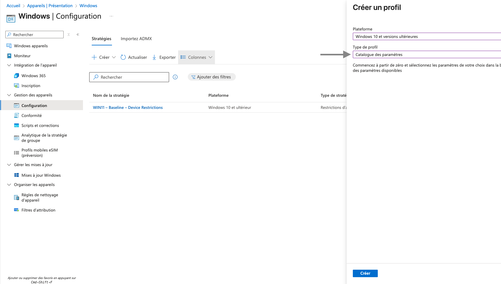
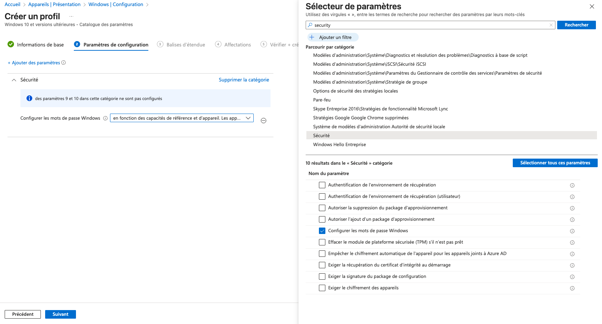
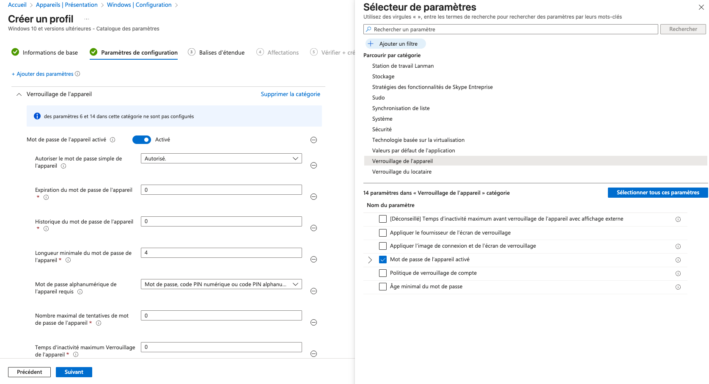
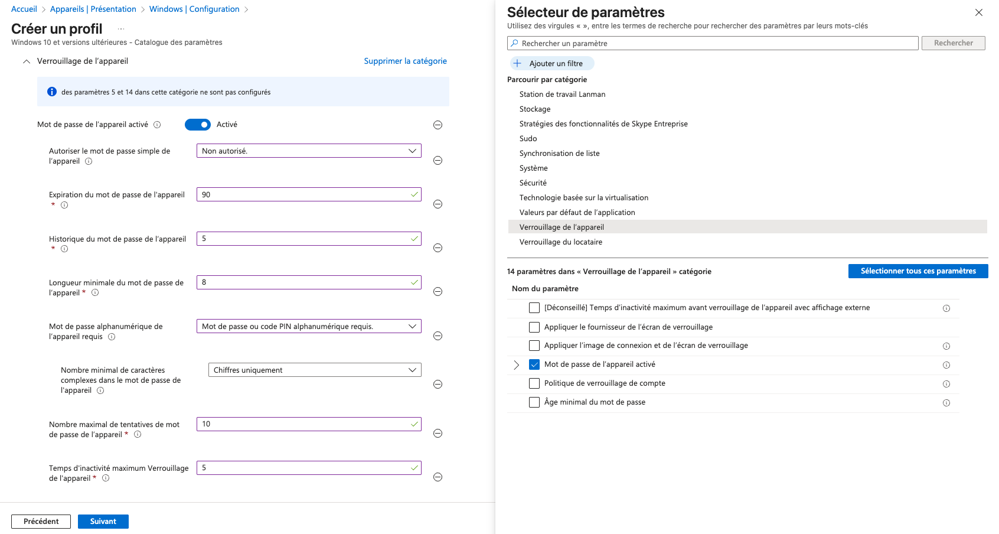
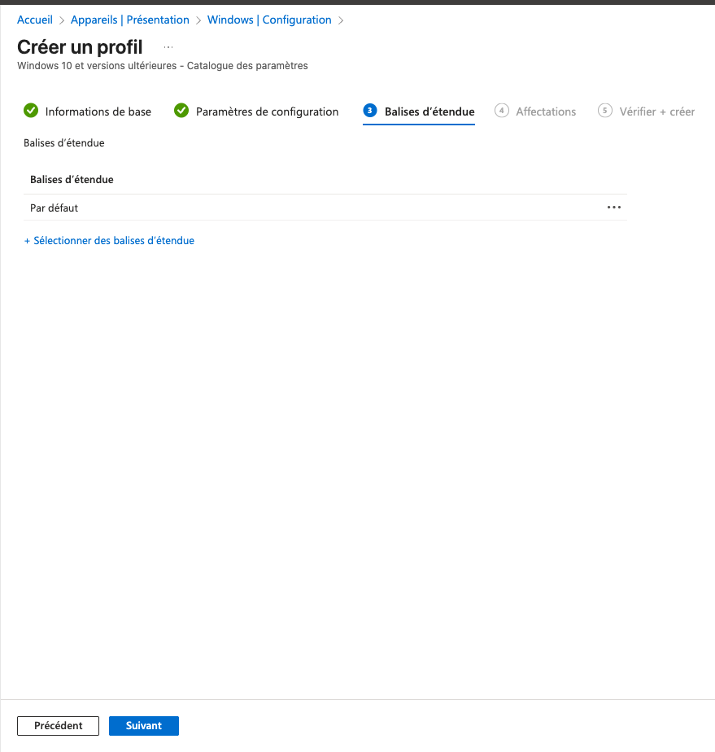
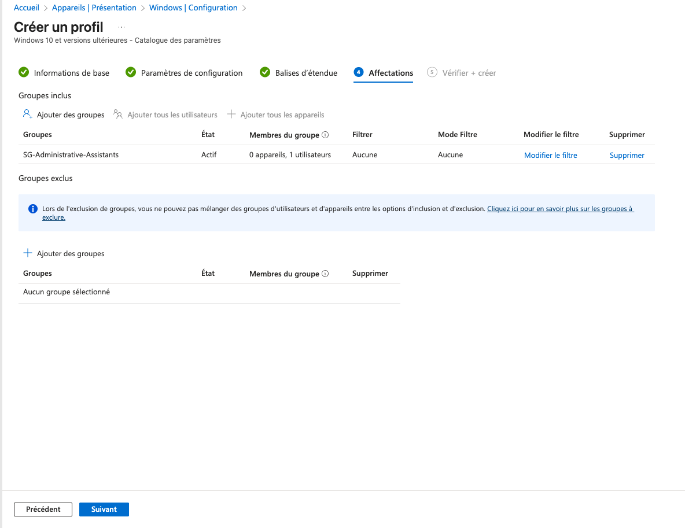
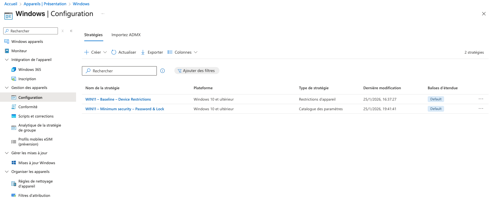
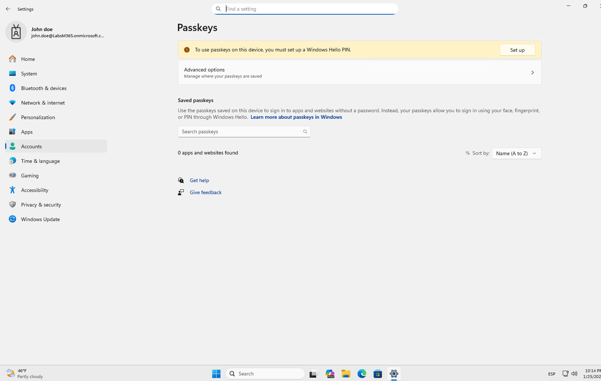

# Lab – Sécurisation minimale Windows 11 (Password & Lock) avec Intune
## Objectif
Mettre en place une stratégie de sécurité minimale sur des appareils Windows 11 via Microsoft Intune, en configurant :
  - Le mot de passe de l’appareil
  - Les règles de verrouillage
  - Les limites de tentatives
  - Le temps d’inactivité

# Étape 1 – Créer un profil de configuration
Chemin :
  - Appareils > Windows > Configuration > Créer
  - Plateforme : Windows 10 et versions ultérieures
  - Type de profil : Catalogue des paramètres

 

# Étape 2 – Ajouter les paramètres de sécurité
Dans le Sélecteur de paramètres :
  - Rechercher : Security
  - Catégorie : Sécurité
  - Ajouter : Configurer les mots de passe Windows

 

# Étape 3 – Configurer le verrouillage de l’appareil (base)
Configurer les paramètres initiaux :
  - Mot de passe de l’appareil : Activé
  - Longueur minimale : 4 caractères
  - Mot de passe simple : Autorisé

 

# Étape 4 – Renforcer la stratégie de mot de passe
Appliquer une configuration plus sécurisée :
  - Mot de passe simple : Non autorisé
  - Expiration : 90 jours
  - Historique : 5 mots de passe
  - Longueur minimale : 8 caractères
  - Mot de passe alphanumérique requis

 

# Étape 5 – Définir les règles de verrouillage
  - Tentatives max : 10
  - Temps d’inactivité avant verrouillage : 5 minutes

 

# Étape 6 – Balises d’étendue (optionnel)
Laisser les balises par défaut ou en appliquer selon l’organisation.

 

# Étape 7 – Affecter le profil
  - Groupe inclus : SG-Administrative-Assistants
  - Aucun groupe exclu
    
 

# Étape 8 – Vérifier la création du profil
  - Le profil apparaît dans la liste des stratégies Windows.

 

## Compétences démontrées
  - Microsoft Intune – Settings Catalog
  - Sécurisation des endpoints Windows
  - Gestion des stratégies de mot de passe
  - Affectations par groupes
  - Documentation claire et professionnelle
