# Enrôlement d’un poste Windows 11 et gestion via Microsoft Intune
## Objectif du laboratoire
L’objectif de ce laboratoire est de démontrer le processus complet d’enrôlement d’un poste Windows 11 dans un environnement Microsoft 365 Business Premium, depuis l’activation des licences jusqu’à la visibilité et la gestion du device dans Microsoft Intune.
Ce scénario correspond à une situation réelle en entreprise, typiquement prise en charge par un technicien IT / administrateur M365 lors de l’onboarding d’un nouvel utilisateur.

## Contexte

Environnement : Microsoft 365 Business Premium (version d’évaluation)
Gestion des identités : Microsoft Entra ID
Gestion des appareils : Microsoft Intune
Poste client : Windows 11
Type de jointure : Microsoft Entra ID Joined

## Étape 1 – Sélection du plan Microsoft 365 Business Premium
Depuis le Microsoft 365 Admin Center, sélectionner le plan Microsoft 365 Business Premium (Trial) afin de bénéficier des fonctionnalités Intune et Entra ID nécessaires à la gestion des appareils.

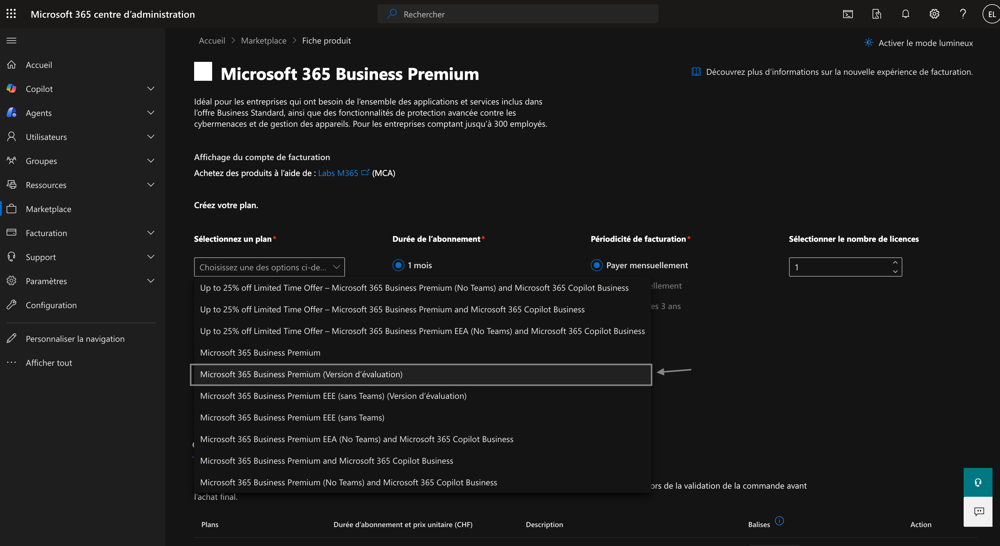

## Étape 2 – Activation de la version d’évaluation
Démarrer la période d’évaluation gratuite et vérifier que l’abonnement est correctement activé.

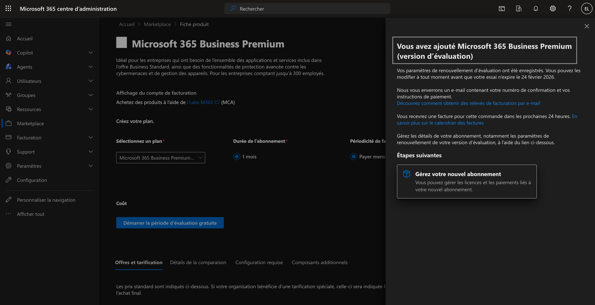

## Étape 3 – Vérification des licences disponibles
Accéder à Billing > Licenses et vérifier la disponibilité des licences Microsoft 365 Business Premium.

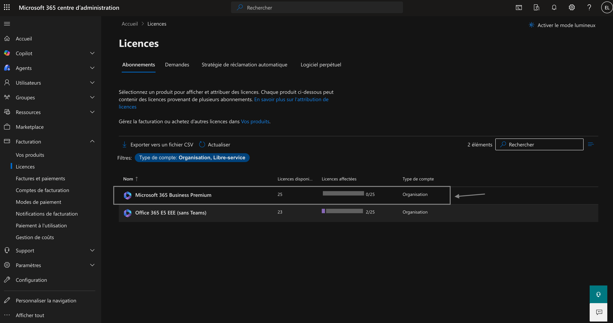

## Étape 4 – Attribution des licences à l’utilisateur
Attribuer une licence Microsoft 365 Business Premium à l’utilisateur cible afin de lui permettre l’enrôlement du poste et l’accès aux services M365.

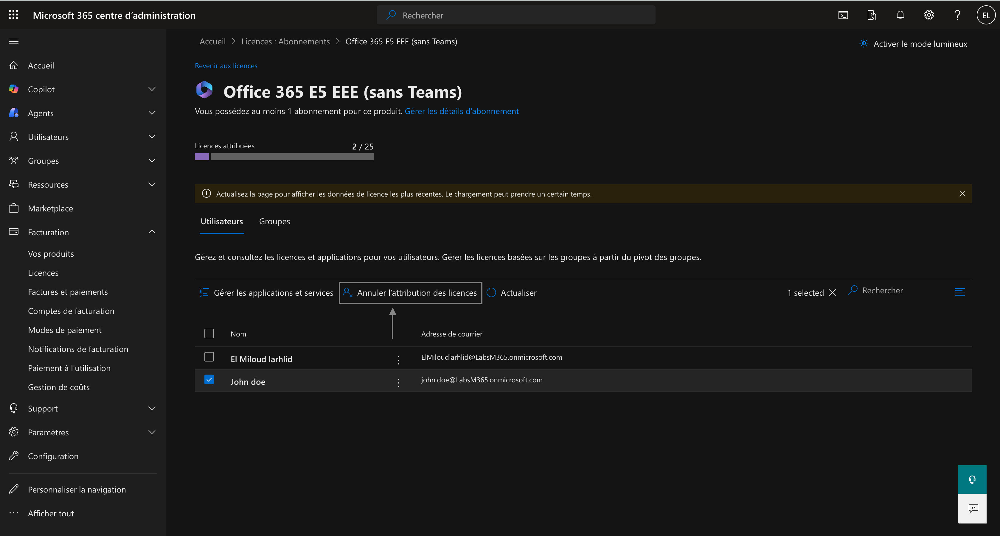

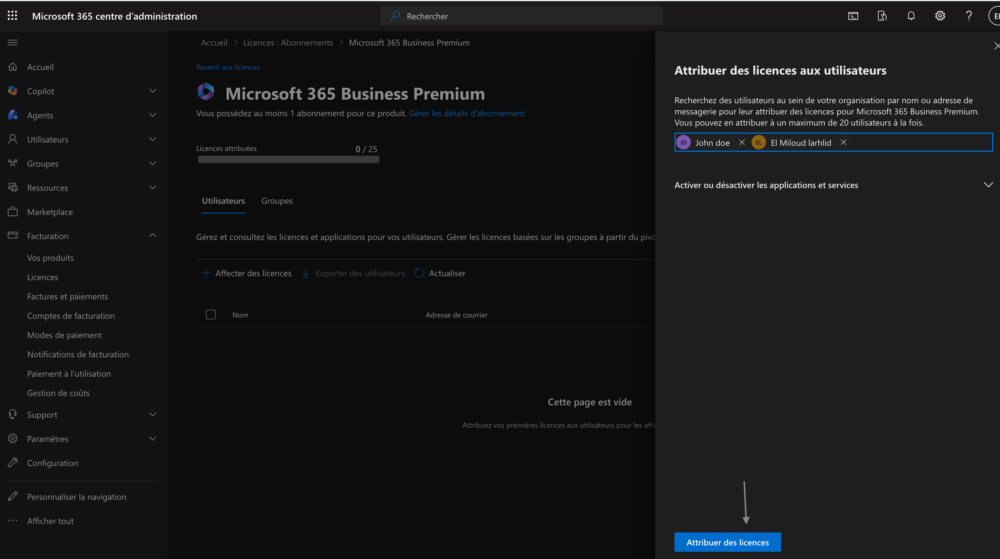

## Étape 5 – Configuration de l’inscription automatique dans Intune
Depuis le Microsoft Intune Admin Center :
Aller dans Devices > Windows > Enrollment
Ouvrir Automatic Enrollment
Activer l’inscription automatique pour tous les utilisateurs
Cette configuration permet l’enrôlement automatique des postes Windows lors de la jointure à Entra ID.

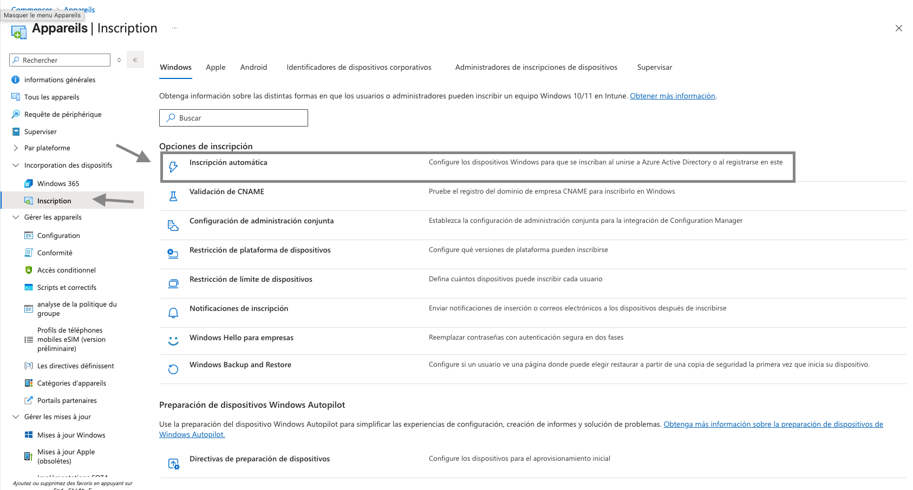

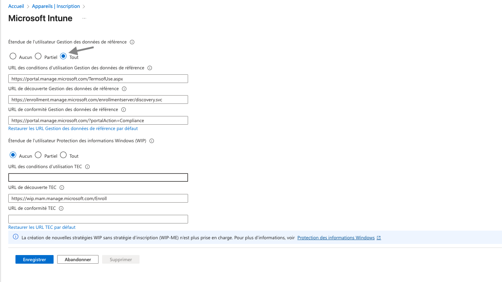

## Étape 6 – Jointure du poste Windows 11 à Microsoft Entra ID
Sur le poste Windows 11 :
Accéder à Settings > Accounts > Access work or school
Sélectionner Join this device to Microsoft Entra ID
S’authentifier avec le compte professionnel

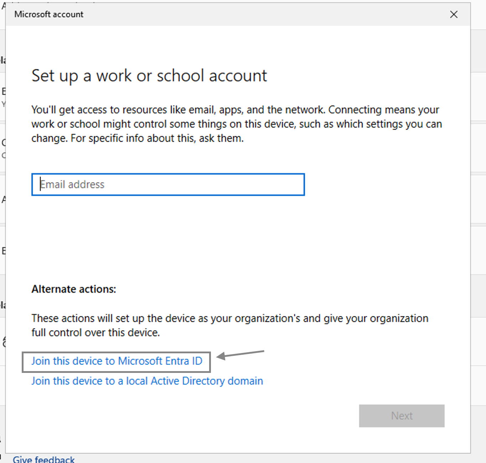

## Étape 7 – Confirmation de l’organisation

Confirmer que l’organisation affichée est correcte et valider la jointure du poste à Entra ID.

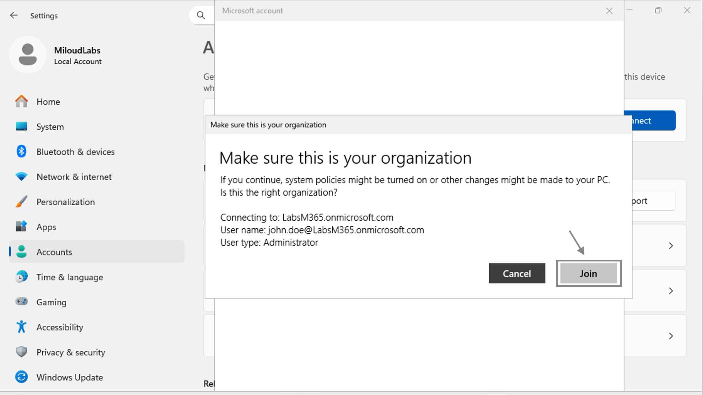

## Étape 8 – Confirmation de la jointure du poste
Une fois l’opération terminée, le message de confirmation indique que le poste est désormais connecté à l’organisation.

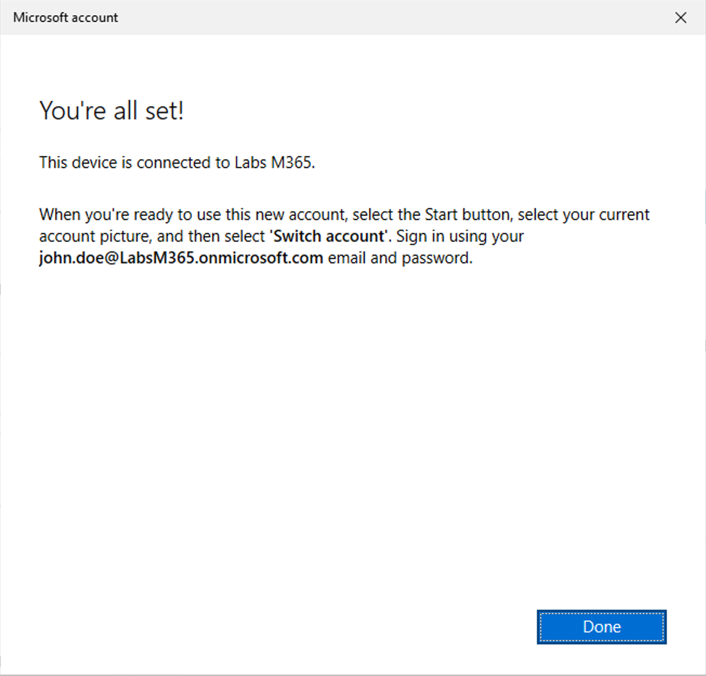

## Étape 9 – Vérification du device dans Microsoft Intune
Depuis le Microsoft Intune Admin Center :
Aller dans Devices > Windows > All devices
Vérifier que le poste Windows 11 apparaît comme :
Enrolled
Managed
Cette étape confirme que l’enrôlement Intune est effectif et fonctionnel.

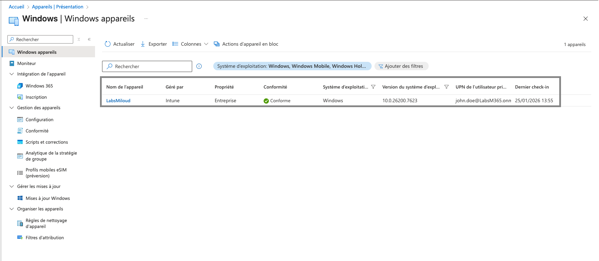

## Compétences démontrées
- Gestion des licences Microsoft 365
- Configuration d’Intune pour l’enrôlement automatique
- Jointure Windows 11 à Entra ID
- Vérification et gestion des appareils dans Intune
